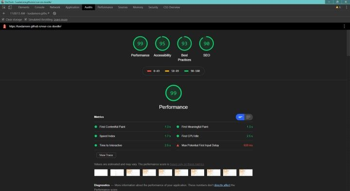

# 🎉 Vue Css Doodle

[DEMO](https://luxdamore.github.io/vue-css-doodle)

> Porting of css-doodle to VueJs, a web component for drawing patterns with CSS

[![npm version][npm-version-src]][npm-version-href]
[![npm downloads][npm-downloads-src]][npm-downloads-href]
[![License][license-src]][license-href]

## Installation

This package is available on npm.

```bash

    # Deps
    npm install --save @luxdamore/vue-css-doodle

```

### Usage

#### As a component

```js

    // Component
    import { VueCssDoodle } from '@luxdamore/vue-css-doodle';
    import '@luxdamore/vue-css-doodle/dist/VueCssDoodle.css';

    // Install
    Vue.component(
        VueCssDoodle.name,
        VueCssDoodle
    );

    // Or in a .vue file
    export default {
        components: {
            'vue-css-doodle': VueCssDoodle,
        },
    };

    // Add this line to your main.js
    Vue.config.ignoredElements = [ 'css-doodle' ];

```

#### As a plugin

```js

    // Plugin
    import VueCssDoodle from '@luxdamore/vue-css-doodle';
    import '@luxdamore/vue-css-doodle/dist/VueCssDoodle.css';

    // Install
    Vue.use(
        VueCssDoodle
    );

```

#### Browser's way

```html

    <!doctype html>
    <html>
        <head>

            <!-- VueCssDoodle style -->

                <!-- Old way -->
                <link rel="stylesheet" href="https://unpkg.com/@luxdamore/vue-css-doodle@latest/dist/VueCssDoodle.css" />
                <!-- end old way -->

                <!-- New way -->
                <link rel="preload" href="https://unpkg.com/@luxdamore/vue-css-doodle@latest/dist/VueCssDoodle.css" as="style" onload="this.rel='stylesheet'" />
                <link rel="preload" href="https://unpkg.com/@luxdamore/vue-css-doodle@latest/dist/VueCssDoodle.umd.min.js" as="script" />
                <!-- end new way -->

            <!-- end VueCssDoodle style -->

        </head>
        <body>

            <!--
                Others script (ex. VueJs) and html.
            -->

            <!-- VueCssDoodle script -->
                <script src="https://unpkg.com/@luxdamore/vue-css-doodle@latest/dist/VueCssDoodle.umd.min.js"></script>
            <!-- end VueCssDoodle script -->

        </body>
    </html>

```

#### Markup

```html

    <vue-css-doodle>
        :doodle {
            @grid: 50x1 / 80%;
        }

        @place-cell: center;
        @size: calc(100% / @size * @i);

        transform: rotate(calc(@i * 5deg));

        border-radius: 30%;
        border: 1px solid hsla(
            calc(10 + 4 * @i), 70%, 68%, @r.8
        );
    </vue-css-doodle>

```

#### Integrations

#### NuxtJS

- Create a file in the `plugins` folder;
- Name it `vue-css-doodle.client.js`;
- Install it _as a plugin_;
- Import it in the `nuxt.config.js` file as [*client side only*](https://nuxtjs.org/guide/plugins/#client-side-only).

### Options

#### Slots

```bash

    # Available
    slot="default" # Add the content, it expose v-slot="{ generate }" method to refresh the doodle

```

### Options

#### Props

| Attribute | Type | Default | Required | About |
|:--------------------:|--------------------|:-------:|:--------:|-------------------------------------|
| title | String | null | false | The title |
| grid | String or Number | null | false | Value of `grid-attr` |
| use | String | null | false | Value of `use-attr` |
| height | String | null | false | Height of the doodle |
| width | String | null | false | Width of the doodle |
| mxAuto | Boolean | false | false | Add `margin-left|right-auto` to the doodle |
| fitWidth | Boolean | false | false | Force the doodle to fit in a `max-width` |
| fitHeight | Boolean | false | false | Force the doodle to fit in a `max-height` |
| fillHeight | Boolean | false | false | Expand the doodle to an `height of 100%` |
| clickToUpdate | Boolean | false | false | Refresh on click |
| overflowHidden | Boolean | false | false | Add `overflow-hidden` to the container |
| absolute | Boolean | false | false | Set position to `absolute` |

Check the [DOCS for more information](https://css-doodle.com/#usage).
___

[npm-version-src]: https://img.shields.io/npm/v/@luxdamore/vue-css-doodle/latest.svg?style=flat-square
[npm-version-href]: https://npmjs.com/package/@luxdamore/vue-css-doodle

[npm-downloads-src]: https://img.shields.io/npm/dt/@luxdamore/vue-css-doodle.svg?style=flat-square
[npm-downloads-href]: https://npmjs.com/package/@luxdamore/vue-css-doodle

[license-src]: https://img.shields.io/npm/l/@luxdamore/vue-css-doodle.svg?style=flat-square
[license-href]: https://npmjs.com/package/@luxdamore/vue-css-doodle

## 🐞 Issues

Please make sure to read the [Issue Reporting Checklist](/.github/ISSUE_TEMPLATE/bug_report.md) before opening an issue. Issues not conforming to the guidelines may be closed immediately.

## 👥 Contribution

Please make sure to read the [Contributing Guide](/.github/ISSUE_TEMPLATE/feature_request.md) before making a pull request.

## 📖 Changelog

Details changes for each release are documented in the [**release notes**](./CHANGELOG.md).

### 📃 License

[MIT License](./LICENSE) // Copyright (©) 2019-present [Luca Iaconelli](https://lucaiaconelli.it)

___

#### 💸 Are you feeling generous today?  :)

Do you want to share a beer? We can be good friends.. __[Paypal](https://www.paypal.me/luxdamore) // [Patreon](https://www.patreon.com/luxdamore)__

> _It's always a good day to be magnanimous - cit_

#### 💼 Hire me

[](https://otechie.com/luxdamore)

[](https://ko-fi.com/luxdamore)

#### 💘 Inspired by

A web component for drawing patterns with CSS, [css-doodle](https://css-doodle.com)

> Check the [full list of doodle on Codepen](https://codepen.io/collection/XyVkpQ)

___

##### 💡 Lighthouse


